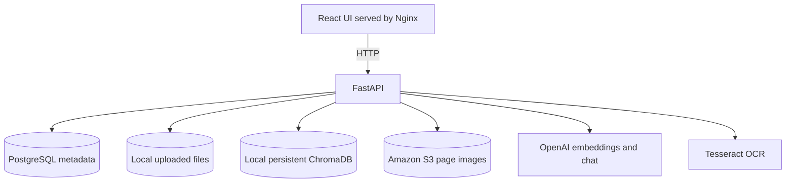

# Architecture

## Runtime components



PostgreSQL contains lifecycle metadata and the source text shown by API endpoints. ChromaDB is a separate persistent vector index. The original uploaded files and ChromaDB directory share the repository-level `storage/` mount in Docker Compose. Extracted PDF page images are temporary locally and durable in S3.

## Ingestion flow

```mermaid
sequenceDiagram
    participant UI as React UI
    participant API as FastAPI
    participant DB as PostgreSQL
    participant S3 as Amazon S3
    participant OCR as Tesseract
    participant AI as OpenAI
    participant V as ChromaDB

    UI->>API: POST /documents/upload
    API->>DB: Create uploaded document
    UI->>API: POST /document/{id}/process
    API->>API: Extract PDF text/pages or analyze CSV
    API->>S3: Upload PDF page images (PDF only)
    API->>DB: Save chunks/assets; mark ready
    UI->>API: POST /document/{id}/embed
    API->>AI: Embed text chunks
    API->>V: Store text vectors
    opt PDF only
        UI->>API: POST /documents/{id}/ocr-assets
        API->>S3: Read page images
        API->>OCR: Extract captions
        API->>DB: Save captions
        UI->>API: POST /documents/{id}/embed-assets
        API->>AI: Embed captions
        API->>V: Store asset vectors
    end
```

The processing calls are synchronous and initiated by the frontend. A document becomes `ready` after its chunks and asset metadata are created; vector and OCR calls then complete the searchable index.

## Retrieval flow

1. The browser sends a question and selected document ID to `POST /chat`.
2. FastAPI creates a question embedding with OpenAI.
3. ChromaDB returns the nearest text and OCR-caption records filtered to the selected document.
4. FastAPI supplies that retrieved context to the chat model.
5. The API deduplicates source metadata and returns the grounded answer.
6. For image sources, the browser requests `GET /assets/{asset_id}` and receives a temporary S3 presigned URL.

## Deletion flow

Deleting a document removes its ChromaDB records, S3 objects, any remaining extracted local images, the original upload, chunk and asset rows, and finally the document row.

## Current boundaries

- Supported uploads: PDF and CSV.
- One selected document is queried by the current UI, though the API accepts multiple document IDs.
- Ingestion runs in API requests rather than a background worker.
- PostgreSQL and local storage are stateful; the frontend is stateless.
<<<<<<< ours
<<<<<<< ours
- The local Compose topology exposes services directly and does not provide authentication or TLS.
=======
- The local Compose topology exposes services directly and does not provide authentication or TLS.
>>>>>>> theirs
=======
- The local Compose topology exposes services directly and does not provide authentication or TLS.
>>>>>>> theirs
